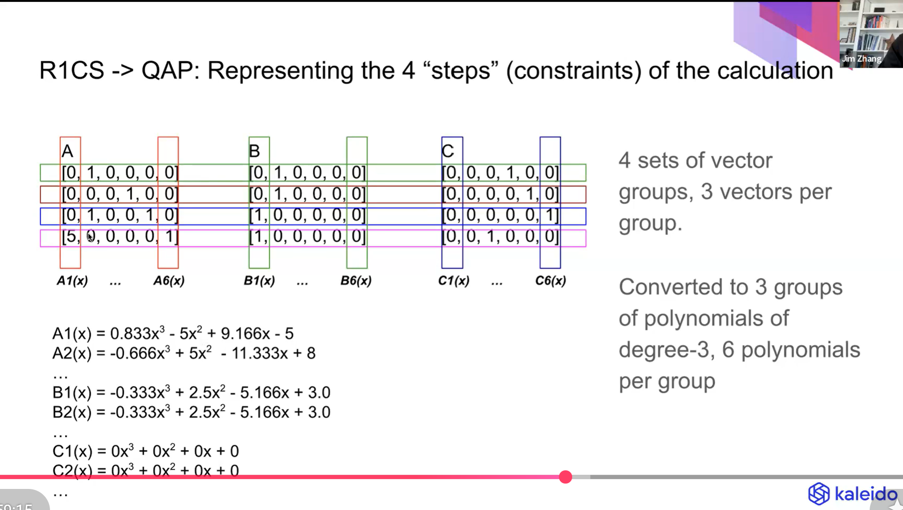
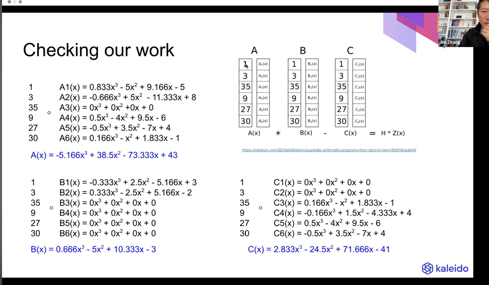

# From Circom to QAP: The Flow from Circuit to SNARK Proofs

This document explains the whole flow from writing a Circom circuit to producing SNARK proofs—broken down and simplified.

---

## **1. Writing the circuit: signals and witness**

We write our circom circuit, which has signals, public and private ones. All these signals are also called **wires**, and they represent our **witness**. The witness is a core component and used in the whole process of generating proof and verifying it.

---

## **2. Constraints: the rules we check**

Once we have our signals ready, we create our **constraints**. They are the rules we will check against to see if they are satisfied. Those constraints are expressed as **multiplications and additions**. Nothing else—and for each constraint we define in the circuit (in the `.circom` file) we have one equation of the form **A × B = C**.

---

## **3. One function that expresses the constraint rules**

Let’s say we have one function that expresses the constraint rules we want to apply, like:

```bash
x³ + 2x + 5
```

---

## **4. Breaking it into multiplication and addition constraints**

We break that down into multiple multiplication and addition constraints, e.g.:

```bash
c1 = x * x
c2 = c1 * x          # now we have x cubed
c3 = (c2 + 2x) * 1   # remember it has to be multiplication
c4 = (c3 + 5) * 1
```

---

## **5. One equation A × B = C per constraint**

These are 4 constraints, and for each we have an equation of the form **A × B = C** (where A, B, C are matrix vectors that represent those computational rules that need to be satisfied when checked against the witness).

---

## **6. The witness vector**

For example in our case here the witness is:

```bash
w = [1, x, c4, c1, c2, c3]
```

---

## **7. First constraint in matrix form: why those vectors?**

The first constraint **c1 = x × x** is of the form **A × B = C**, where A is x, B is x and C is c1. To represent that in matrix form against the witness:

- **A = [0, 1, 0, 0, 0, 0]**  
- **B = [0, 1, 0, 0, 0, 0]**  
- **C = [0, 0, 0, 1, 0, 0]**

**Why?**

- **A · w** ⇒ `0·1 + 1·x + 0·c4 + 0·c1 + 0·c2 + 0·c3 = x`
- **B · w** ⇒ `0·1 + 1·x + 0·c4 + 0·c1 + 0·c2 + 0·c3 = x`
- **C · w** ⇒ `0·1 + 0·x + 0·c4 + 1·c1 + 0·c2 + 0·c3 = c1`

So **A · w** and **B · w** give x, **C · w** gives c1, and the constraint **A × B = C** (in the sense of the dot product with w) holds because **c1 = x × x** in our constraints. The same idea applies to the rest of the constraints.

---

## **8. R1CS in a nutshell**

So in a nutshell that is the **R1CS form** of the constraints: a set of matrix vectors A, B, C, for example:

- First constraint:  
  **A = [0, 1, 0, 0, 0, 0]**  
  **B = [0, 1, 0, 0, 0, 0]**  
  **C = [0, 0, 0, 1, 0, 0]**

and similarly for all constraints.

---

## **9. From R1CS to Quadratic Arithmetic Polynomials (QAP)**

Then these matrix vectors are converted to **Quadratic Arithmetic Polynomials (QAP)**.

The process is explained here: https://www.youtube.com/watch?v=JOCUTtEeXyk (around minute 30). That’s a good high-level explanation.

---

## **10. Example: the A vectors for our 4 constraints**

A quick example of the technique for the **A** vectors we get when we move from constraints to R1CS.

We have 4 constraints, so 4 equations of the form **Aᵢ × Bᵢ = Cᵢ** (i = 1…4). Based on the witness:

```bash
w = [1, x, c4, c1, c2, c3]
```

**Why this order?**  
The witness always has **1** first, no matter the constraints; then we put the **input**, then the **final output**, then the **intermediate variables** in order.

Reminder of constraints and witness:

```bash
w = [1, x, c4, c1, c2, c3]

c1 = x * x
c2 = c1 * x          # now we have x cubed
c3 = (c2 + 2x) * 1   # remember it has to be multiplication
c4 = (c3 + 5) * 1
```

The **Aᵢ** vectors look like this:

- **A1 = [0, 1, 0, 0, 0, 0]** — because **A1 · w** gives the **left part of the first constraint**. We find **Bᵢ** the same way.
- **A2 = [0, 0, 0, 1, 0, 0]** — because **A2 · w** gives the left part of the **second** constraint.
- **A3 = [0, 2, 0, 0, 1, 0]**
- **A4 = [5, 0, 0, 0, 0, 1]**

---

## **11. Slicing vertically: from vectors to polynomials**
---
- 


---

That’s how we get all the matrices. To **compute the polynomials**, we slice those 4 vectors **vertically**. So we have **6 polynomials** (because we have 6 entries in each Aᵢ vector). We go index by index and ask:

- For **x = 1**, what polynomial **A(x)** gives value **0**?
- For **x = 2**, what **A(x)** gives **0**?
- For **x = 3**, what **A(x)** gives **0**?
- For **x = 4**, what **A(x)** gives **5**?

Why? Because if you look at the 4 A vectors **vertically**, in the first row you have **0, 0, 0, 5**—and that’s why we ask for x=1 ⇒ A(x)=0, etc.

So we compute:

- **6** **A(x)** polynomials  
- **6** **B(x)** polynomials  
- **6** **C(x)** polynomials  

That’s **3 groups of 6 polynomials** each.

---

## **12. Compressing to one polynomial per group**

- 

To avoid making the verifier recompute everything, we **compress** down to **1 polynomial per group**.

How? We multiply each entry of the witness **w = [1, x, c4, c1, c2, c3]** with the corresponding **Aᵢ(x)** polynomial and add them together. So we get **one** polynomial **A(x)**, **one** **B(x)**, and **one** **C(x)**.

---

## **13. The final check: A(x)·B(x) − C(x) = H(x)·Z(x)**

And the final check we basically do is **A(x) × B(x) − C(x) = H(x) × Z(x)**, where **Z(x)** is the zero polynomial derived from the actual constraints. So if we have 4 constraints:

```bash
Z(x) = (x-1)(x-2)(x-3)(x-4)
```

and we need to check that when we divide the **final polynomial from the left** with **Z(x)** we get a result with **no remainder**.

That is it. Very top level. GREAT.


## **Further reading**

For more details you can check the technical deep-dive video: https://www.youtube.com/watch?v=JOCUTtEeXyk
